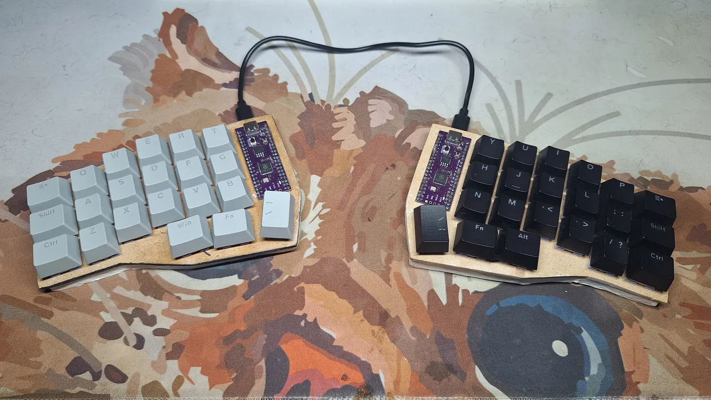

# Split Keyboard

A handmade 42-key split mechanical keyboard built around two Raspberry Pi Picos running [KMK firmware](https://github.com/KMKfw/kmk_firmware) in MicroPython/CircuitPython. The case was sculpted by hand using air-dry clay.



## Hardware

| Component | Details |
|---|---|
| Controller | Raspberry Pi Pico (×2) |
| Switches | Akko Fairy Silent (×42) |
| Layout | 21 keys per half |
| Connection | USB-C (wired split, UART) |
| Case | Hand-sculpted air-dry clay |

## Flashing

1. Flash CircuitPython onto both Picos ([download](https://circuitpython.org/board/raspberry_pi_pico/))
2. Copy the KMK source onto each Pico's filesystem ([KMK setup](https://kmkfw.io/docs/Getting_Started))
3. Copy `firmware/keymap.py` onto **both** Picos (shared layout, used by both halves)
4. Copy `firmware/codeL.py` as `code.py` onto the left Pico
5. Copy `firmware/codeR.py` as `code.py` onto the right Pico
6. Connect both halves via USB-C — the left half acts as the USB host

## Build Notes

The case was the most unconventional part of this build — sculpted from air-dry clay, shaped around the switch plate, and left to cure.

Each half uses a Raspberry Pi Pico flashed with CircuitPython + KMK. The two halves communicate over UART through the USB-C cable. The key matrix is hand-wired (4 rows × 6 columns per half, diodes oriented col-to-row).

## Status

Functional, in daily use. Layers: base, symbols/numbers, and arrow navigation.

## Repository Structure

```
.
├── firmware/
│   ├── keymap.py    # shared keymap (both halves load this)
│   ├── codeL.py      # left half entrypoint (flash as code.py)
│   └── codeR.py      # right half entrypoint (flash as code.py)
├── hardware/
│   └── image5.webp   # build photo
└── README.md
```

## License

MIT
